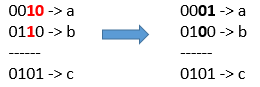

# Minimum Flips to Make a OR b Equal to c


Given 3 positives numbers `a`, `b` and `c`. Return the minimum flips required in some bits of `a` and `b` to make ( `a` OR `b` == `c` ). (bitwise OR operation).
Flip operation consists of change **any** single bit 1 to 0 or change the bit 0 to 1 in their binary representation.

**Example 1:**



```
Input: a = 2, b = 6, c = 5
Output: 3

Explanation: After flips a = 1 , b = 4 , c = 5 such that (a OR b == c)
```
**Example 2:**
```
Input: a = 4, b = 2, c = 7
Output: 1
```
**Example 3:**
```
Input: a = 1, b = 2, c = 3
Output: 0
```

**Constraints:**
- `1 <= a <= 10^9`
- `1 <= b <= 10^9`
- `1 <= c <= 10^9`

## My Solution (Spoiler alert)
### Intuition
Write the logic table:

| a | b | c | flip? | a^b^c |
|---|---|---|-------|-------|
| 0 | 0 | 0 | 0     | 0     |
| 0 | 1 | 0 | 1     | 1     |
| 1 | 0 | 0 | 1     | 1     |
| 1 | 1 | 0 | 2 (!) | 0 bad |
| 0 | 0 | 1 | 1     | 1     |
| 0 | 1 | 1 | 0     | 0     |
| 1 | 0 | 1 | 0     | 0     |
| 1 | 1 | 1 | 0     | 1 bad |


### Approach
We can see that in ALMOST every case, `c` corresponds to `a XOR b`. Meaning if either `a` or `b` but not both are on, `c` should be on. So it's as if we're saying flip only when one of them is looking alone. In other words: a XOR b XOR c, that is `a^b^c` aligns very closely with `flip`.

There are only two situations when this doesn't work. That's when both `a` and `b` are on, i.e. `a & b`. In that situation due to the definition of OR, exceptions apply to the calculation of `c`. If they're both on, `c` is acceptable as on. If c is off, we'd need to turn 2 (!) of them off. This last sentence can be expressed as counting bits where `a & b & ~c` and multiplying them by `2` cost (the first part of the program formula)

The second part of the program is where normal logic rows exist, i.e. the `~(a & b)` to exclude the weird rows. Then the earlier `(a ^ b ^ c)` generalization applies and count bits that qualify.

Note - I don't know if older Python penalizes for counting bits, but the new Python has a direct `bit_count` method on `int`.

### Complexity
- Time complexity: O(1)
<!-- Add your time complexity here, e.g. $$O(n)$$ -->

- Space complexity: O(1)
<!-- Add your space complexity here, e.g. $$O(n)$$ -->

### Code
```
class Solution:
    def minFlips(self, a: int, b: int, c: int) -> int:
        return (bin(a & b & ~c).count("1") * 2) + bin(~(a & b) & (a ^ b ^ c)).count("1")

```