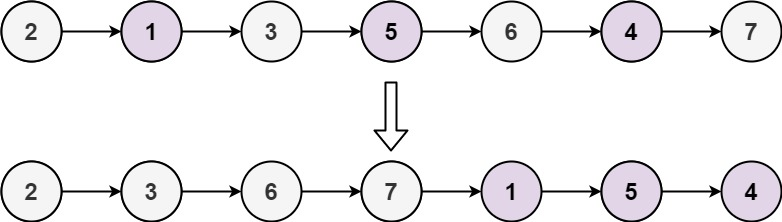

# Odd Even Linked List

[](https://github.com/aminariana/leetcode)

Given the `head` of a singly linked list, group all the nodes with odd indices together followed by the nodes with even indices, and return *the reordered list*.

The **first** node is considered **odd**, and the **second** node is **even**, and so on.

Note that the relative order inside both the even and odd groups should remain as it was in the input.

You must solve the problem in `O(1)` extra space complexity and `O(n)` time complexity.

 
**Example 1:**


```
Input: head = [1,2,3,4,5]
Output: [1,3,5,2,4]
```

**Example 2:**


```
Input: head = [2,1,3,5,6,4,7]
Output: [2,3,6,7,1,5,4]
```

**Constraints:**

- The number of nodes in the linked list is in the range `[0, 10^4]`.
- `-106 <= Node.val <= 106`